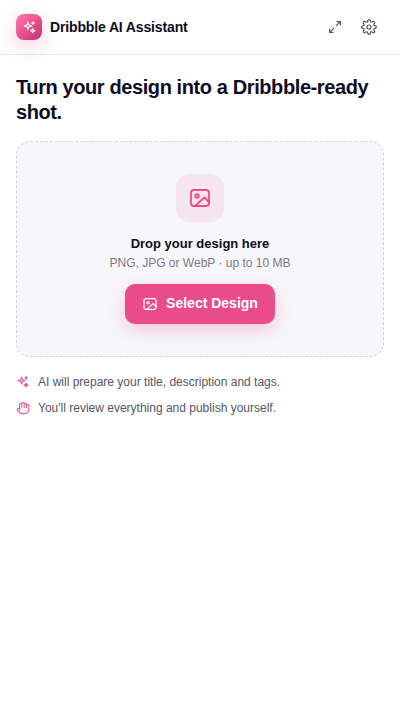
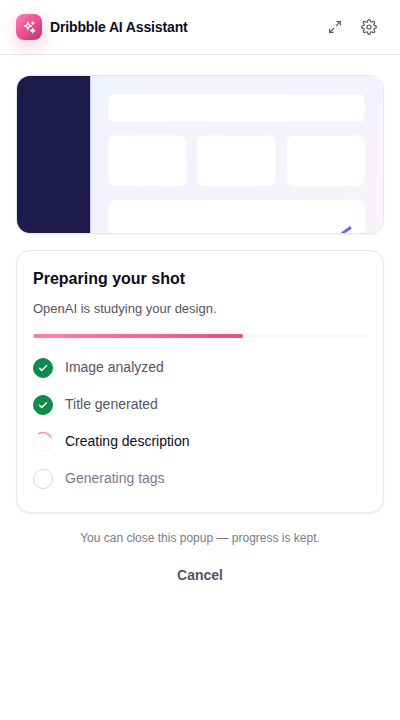
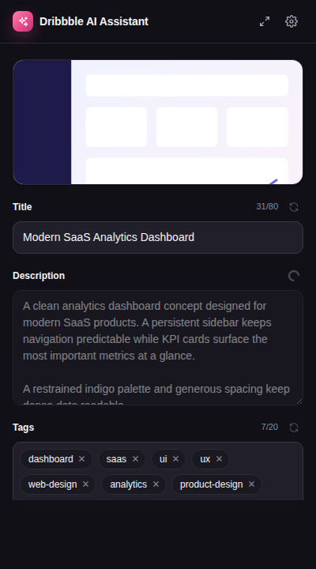
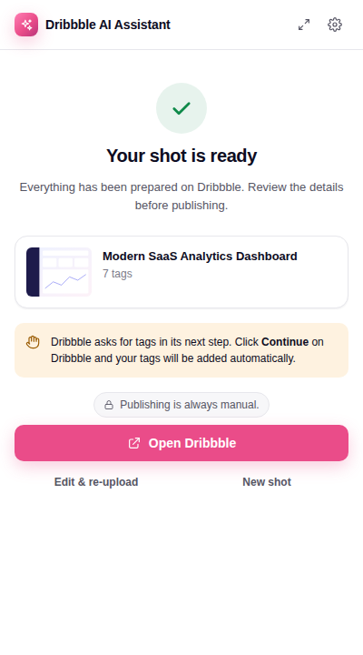

# Dribbble AI Assistant

A Chrome extension (Manifest V3) that turns a design image into a Dribbble-ready shot. AI writes the title, description and tags, then the extension fills in Dribbble's upload form for you.

**It never publishes.** Automation stops once the form is filled. You review everything on Dribbble and click Publish yourself.

| Select | Prepare | Review (dark) | Ready |
| --- | --- | --- | --- |
|  |  |  |  |

---

## 1. Installation

Requirements: Node.js 20.19+ and Chrome (or another Chromium browser) 116+.

```bash
npm install
```

## 2. Development

```bash
npm run dev
```

This builds into `dist/` in watch mode. After you change the background worker or the content script, reload the extension from `chrome://extensions`. After a popup change, just reopen the popup.

In development builds (only), `VITE_DEV_OPENAI_API_KEY` / `VITE_DEV_GEMINI_API_KEY` from `.env.local` are used as fallback API keys, so you don't have to re-enter it after every reload. See `.env.example`.

## 3. Building

```bash
npm run build      # typecheck + production bundle in dist/
npm run test       # unit tests (Vitest + jsdom)
```

## 4. Loading the extension into Chrome

1. Run `npm run build` (or `npm run dev`).
2. Open `chrome://extensions` and turn on **Developer mode**.
3. Click **Load unpacked** and select the **`dist/`** folder.

> Don't load the repository folder itself (for example a ZIP downloaded from GitHub). The root `manifest.json` is only the build template, and Chrome will report *"Could not load background script"*. The loadable extension only exists in `dist/` after a build.
4. Pin **Dribbble AI Assistant** to the toolbar.

## 5. Configuring AI

Open the popup, click the gear icon, choose a provider, and enter your API key.

| Provider | Get a key | Default model |
| --- | --- | --- |
| OpenAI | [platform.openai.com/api-keys](https://platform.openai.com/api-keys) | `gpt-4o-mini` |
| Google Gemini | [aistudio.google.com/app/apikey](https://aistudio.google.com/app/apikey) | `gemini-flash-latest` |

Switching provider resets the model and base URL to that provider's defaults. Google retires Gemini model names regularly. If the configured Gemini model returns *not found*, the extension asks the API which models your key can use and switches to the newest Flash model automatically. Each provider's key is stored separately, so you can switch back and forth without re-entering them.

| Setting | Notes |
| --- | --- |
| Provider | OpenAI (or any OpenAI-compatible API via **Advanced → API base URL**), or Google Gemini. |
| API key | Stored in `chrome.storage.local` on this device only. It is never synced, never readable by the content script, and never committed or bundled. |
| Model | Must accept image input. Change it under **Advanced**; build-time default via `VITE_AI_MODEL`. |
| Tone | Professional, Minimal or Creative. |
| Tag count | 5, 8, 10 or 12. |
| Always include tags | Tags added to every shot, such as your studio name. |

Build-time defaults live in `.env.example`. A custom API host asks for your permission (an optional host permission) when you save it.

### Adding another AI provider

1. For a JSON-capable chat API, extend `JsonPromptProvider` (`src/ai/json-provider.ts`) and implement only `complete()`, the HTTP call. See `openai-provider.ts` and `gemini-provider.ts`. Prompts, validation, retries and error mapping are shared. Otherwise implement the `AIProvider` interface in `src/ai/ai-provider.ts` directly.
2. Add its descriptor to `PROVIDERS` in `src/ai/providers.ts`.
3. Add its API host to `host_permissions` in `manifest.json`.

Nothing else in the app depends on a specific provider.

## 6. Using the extension

1. Log in to Dribbble in your browser as usual.
2. Click the extension, then **Select Design** (or drag an image in). PNG, JPG or WebP, up to 10 MB.
3. Click **Prepare Shot**. The image is optimized locally, then **one** AI request analyzes it and writes the title, description and tags together. Each ↻ regenerate costs one more request. This matters on free tiers: Gemini's free tier, for example, allows about 5 requests a minute and 20 a day. If a limit is hit, the extension says so and does not retry automatically, so no extra quota is used.
4. Edit anything you like. Each field has a ↻ button to regenerate just that field. Tags can be added with Enter or a comma, and removed with × or Backspace.
5. Click **Upload to Dribbble**. The extension opens `dribbble.com/uploads/new`, places your image in Dribbble's own uploader, and fills in the title and description. A small banner on the page shows what it is doing.
6. Dribbble asks for tags in its final step. The extension clicks **Continue**, which only opens the *Final touches* dialog, and fills in your tags there. It never touches **Publish now** or **Save as draft**. If it can't find a Continue button, it waits for you to click it and then adds the tags.
7. Review everything and **publish manually**.

You can close the popup at any time. Progress lives in the background worker and the popup picks up where you left off. If your OS closes the popup when the file picker opens, use the ⤢ button to open the assistant in a full tab.

## 7. Privacy

| What | Where it goes |
| --- | --- |
| **Processed locally** | File-type validation (magic bytes, not just the extension), size checks, dimensions, preview thumbnail, and downscaling to ≤1536 px before analysis. |
| **Sent to the AI provider** | Only the image you selected (the downscaled copy) and the text prompts. It is sent directly from your browser, with no intermediate server, and only when you click Prepare Shot or regenerate. |
| **Sent to Dribbble** | Your original image and the content you approved. They go through Dribbble's normal upload page, in your existing logged-in session, only when you click Upload to Dribbble. |
| **Stored** | Preferences in `chrome.storage.sync`. API key in `chrome.storage.local`. The current image and draft live in `chrome.storage.session`, which is memory-only and cleared when the browser closes or when you click "New shot". |

The extension does **not**:

- read any file you didn't pick
- run on any site except the Dribbble tab it opens: the content script is injected on demand, with no `<all_urls>` and no static content scripts
- access cookies or browsing history
- ask for your Dribbble password
- auto-publish anything

Permissions requested: `storage`, `scripting`, and host access to `dribbble.com`, `api.openai.com` and `generativelanguage.googleapis.com` (Gemini).

## 8. Known Dribbble limitations

- **Unverified selectors.** Dribbble has no public upload API for regular accounts, so the extension drives the normal web UI. The selectors target the uploader as it looked when this was written. They are tested against a mock of that flow, not against the live site, which this project's build environment could not reach. Expect to adjust `src/dribbble/selectors.ts` after your first real run (see §9).
- **Tags come in a later step.** Tags live in Dribbble's *Final touches* dialog. The extension opens it by clicking Continue (an exact "Continue" button only). If that isn't possible, it waits up to 20 minutes for you to open the dialog. If the dialog opens but the tag field isn't recognised, it says so instead of guessing.
- **Description editor.** The description is a rich-text editor. Text is inserted with a paste-style event so the editor keeps its own state. If that fails, the popup warns you to double-check the description.
- **Login and security checks.** If you're logged out, or Dribbble shows a CAPTCHA or security check, automation stops and tells you to resolve it yourself. It never tries to bypass either.
- **Upload limits.** Dribbble's own limits apply (10 MB per image; recommended 1600×1200 or larger).
- **No guessing when the page changes.** If the page doesn't look like the expected editor, the extension stops with *"Dribbble's upload interface appears to have changed. Please complete the upload manually."* It never guesses.

## 9. Updating selectors when Dribbble changes its UI

All Dribbble-specific knowledge is isolated in `src/dribbble/`:

| File | Responsibility |
| --- | --- |
| `selectors.ts` | **Every selector.** Usually the only file you need to touch. |
| `navigation.ts` | Upload/login URLs, login and CAPTCHA detection. |
| `upload.ts` | Putting the file into Dribbble's uploader and waiting for confirmation. |
| `form.ts` | Filling title, description and tags, and verifying each write. |
| `dom-utils.ts` | Generic helpers: locator strategies, React-safe value setting, waits. |

Steps:

1. Open `https://dribbble.com/uploads/new` and inspect the element that changed.
2. In `selectors.ts`, add a locator at the right priority. Prefer, in this order:
   1. `by.label(/…/)` (visible label text)
   2. `by.attribute('aria-label' | 'placeholder', /…/)`
   3. `by.editablePlaceholder(/…/)` for rich-text editors
   4. `by.css('[name=…]')` and other stable attributes

   Never use generated class names such as `.sc-a1b2c3`.
3. Update the mock in `tests/fixtures/dribbble-dom.ts` to match the new markup, then run `npm test`.
4. Keep `PUBLISH_CONTROLS` up to date as well. The publish guard uses it to recognise (and never touch) the publish button.

## Architecture

```text
Popup (React) ──Port "workflow"──▶ Background service worker ──tabs.sendMessage──▶ Content script ──▶ Dribbble upload page
     ▲                                  │   ▲                                            │
     └────────── STATE_UPDATED ─────────┘   └───────── UPLOAD_PROGRESS / TAGS_FILLED ────┘
```

- **`src/background/`** owns the workflow state machine (`idle → selected → preparing → review → uploading → ready`), persists it in session storage, runs the AI calls (so they survive the popup closing), and opens and drives the Dribbble tab.
- **`src/popup/`** is a view of the background state, plus the settings screen. Edits are kept in a local draft that merges safely with AI regenerations.
- **`src/content/`** is injected only into the upload tab. Its whole surface is `PING`, `PROBE_PAGE`, `UPLOAD_IMAGE` and `FILL_SHOT_DETAILS`. **There is no publish command.**
- **`src/ai/`** contains the provider interface, the OpenAI and Gemini implementations (sharing `json-provider.ts`), prompts, and schema validation of AI output. Malformed JSON, missing fields and oversized tag lists are handled, with one automatic retry.
- **`src/image/`** holds local-only validation and processing.
- **`src/messaging/messages.ts`** holds the typed message contracts.

### The publishing boundary

Publishing is never automated, and this is enforced in four layers:

1. **No API.** Neither the content script nor the message contracts have a publish or submit command.
2. **One click, and never Publish.** The only control the extension activates is the editor's **Continue** button, which opens the tag dialog. It is matched by exact text and refused if it looks like a publish or submit control (`src/dribbble/steps.ts`, the only file allowed to click). The code never calls `.submit()` or `requestSubmit()`. Filling uses value setters, paste events and synthetic key presses, and browsers never turn untrusted key events into form submissions.
3. **Runtime guard.** While automation runs, `src/content/publish-guard.ts` cancels any form submission and any scripted click on a publish or submit control. This catches the case where the page's own handlers react to a simulated key press. The guard is removed afterwards, so your own clicks are never affected.
4. **Tests.** `tests/dribbble/no-publish.test.ts` runs the full flow against a mock Dribbble page and asserts that the publish button is never activated, no form is submitted, `submit`/`requestSubmit` are never called, and the only `click` is on Continue. It also scans the integration source to make sure `steps.ts` is the only file that clicks, and that no publish/submit function or message exists.

## Browser support

The code uses standard WebExtension APIs through `chrome.*`. To add Firefox or Edge:

- Edge works as is with **Load unpacked**.
- Firefox needs a `browser_specific_settings.gecko.id` in the manifest. Firefox MV3 also uses `background.scripts` instead of `service_worker`, so add a second manifest variant in `vite.config.ts`.

## Project layout

```text
src/
  ai/          provider interface, OpenAI + Gemini providers, prompts, schema validation, generator
  background/  service worker, workflow state machine, tab + image stores
  content/     content script, controller, publish guard, on-page status banner
  dribbble/    selectors, navigation, upload, form, DOM helpers
  image/       validation, encoding, resizing (local only)
  messaging/   typed message contracts
  popup/       React UI: components, pages, hooks, design tokens (styles/app.css)
  storage/     settings + API key storage
  types/       shared domain types
  utils/       errors, tag normalisation
tests/         Vitest suites + mock Dribbble DOM
scripts/       dev watcher, icon generator
```
